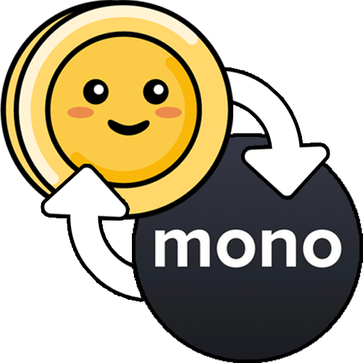

# Lunch Mono

<p align="center">
  
</p>

<p align="center">
  <strong>Seamlessly sync your Monobank transactions to Lunch Money</strong>
</p>

<p align="center">
  A desktop application for effortlessly managing and synchronizing your financial transactions between Monobank and Lunch Money.
</p>

---

## 🚀 Quick Start

1. **Download** the latest release for your platform from the [Releases page](https://github.com/akutishevsky/lunchmono/releases)
2. **Extract** the ZIP file and launch the application
3. **Configure** your API tokens in Settings (⚙️)
4. **Map** your Monobank accounts to Lunch Money assets (💳)
5. **Sync** your transactions with ease!

## 📖 Documentation

- **[User Guide](./USER_GUIDE.md)** - Comprehensive setup and usage instructions
- **[Changelog](./CHANGELOG.md)** - Version history and release notes
- **[Releases](https://github.com/akutishevsky/lunchmono/releases)** - Download the latest version

## ✨ Features

- 🔒 **Secure** - API tokens encrypted with OS-level security
- 🌍 **Cross-platform** - Available for macOS, Windows, and Linux
- 💱 **Multi-currency** - Automatic currency conversion handling
- 🎯 **Simple** - Clean, intuitive interface
- ⚡ **Fast** - Embedded server for quick operations

## 🛠️ Development

```bash
# Install dependencies
npm install

# Start development mode
npm start

# Build for all platforms
npm run make:all
```
