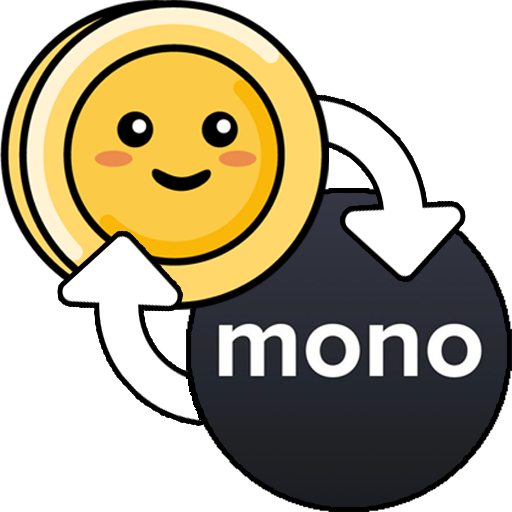

# Lunch Mono

<p align="center">
  
</p>

<p align="center">
  <strong>Seamlessly sync your Monobank transactions to Lunch Money</strong>
</p>

<p align="center">
  A desktop application for effortlessly managing and synchronizing your financial transactions between Monobank and Lunch Money.
</p>

---

## 🚀 Quick Start

> **Note:** This application is not code-signed. Due to macOS/Windows security restrictions, you'll need to build it yourself from source.

### Building from Source

```bash
# Clone the repository
git clone https://github.com/akutishevsky/lunchmono.git
cd lunchmono

# Install dependencies
npm install

# Build for your platform
npm run make:mac    # macOS
npm run make:win    # Windows
npm run make:linux  # Linux
npm run make:all    # All platforms
```

The built application will be available in the `out/make` directory.

### Getting Started

1. **Build** the application using the instructions above
2. **Launch** the application from the `out/make` directory
3. **Configure** your API tokens in Settings (⚙️)
4. **Map** your Monobank accounts to Lunch Money assets (💳)
5. **Sync** your transactions with ease!

## 📖 Documentation

- **[User Guide](./docs/user-guide.md)** - Comprehensive setup and usage instructions
- **[Changelog](./CHANGELOG.md)** - Version history and release notes

## ✨ Features

- 🔒 **Secure** - API tokens encrypted with OS-level security
- 🌍 **Cross-platform** - Available for macOS, Windows, and Linux
- 💱 **Multi-currency** - Automatic currency conversion handling
- 🎯 **Simple** - Clean, intuitive interface
- ⚡ **Fast** - Embedded server for quick operations

## 🛠️ Development

```bash
# Start development mode with hot reload
npm start
```
